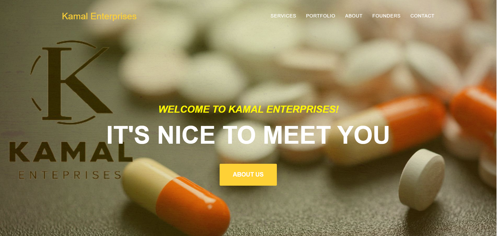
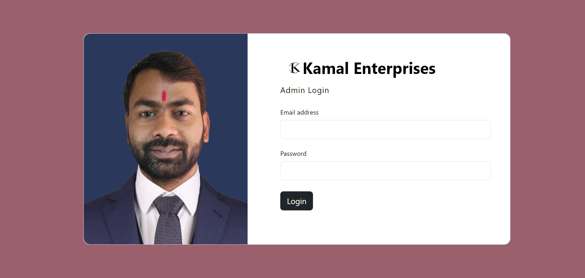
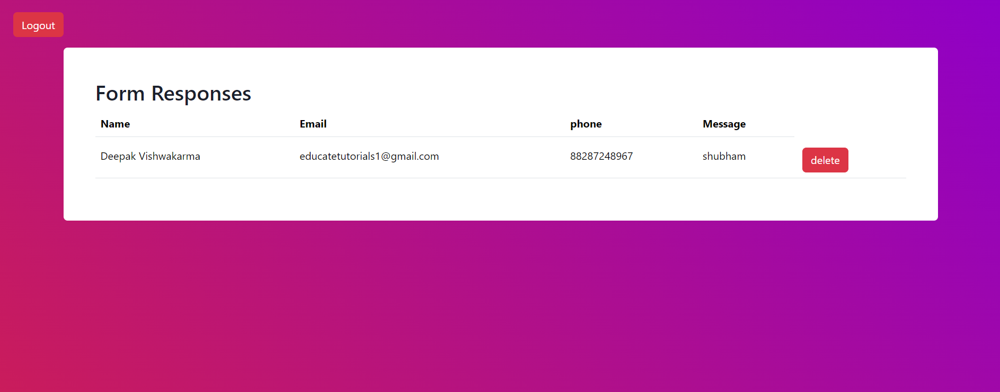
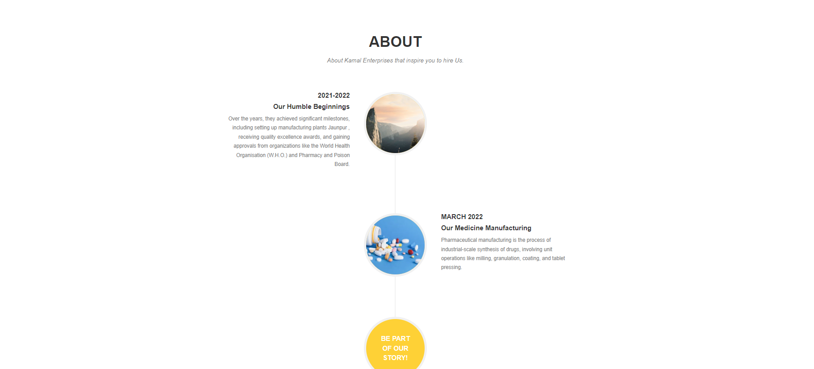
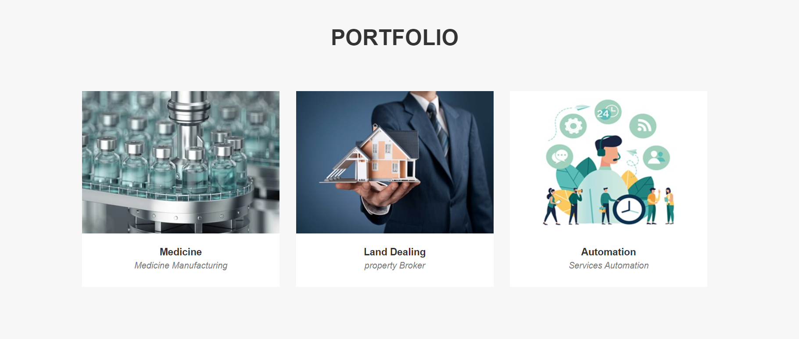
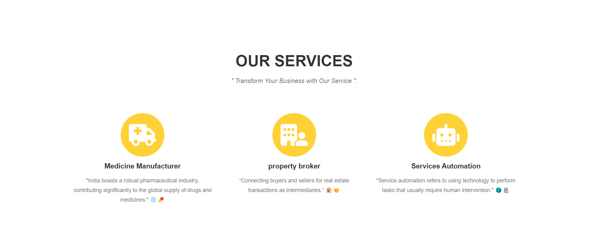
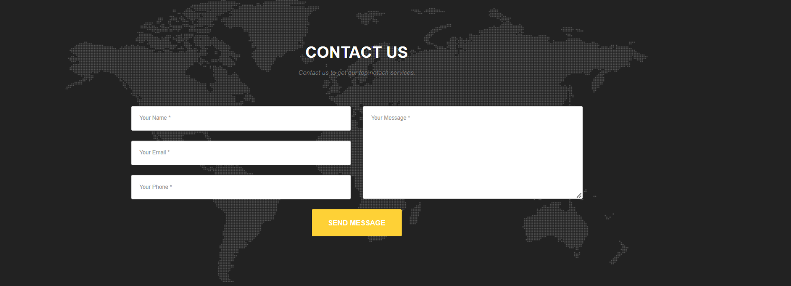

# project_kamal_Enterprises
# Kamal Enteprises WebApp

## I used php and mysql for backend 

### This  web project done in html,css ,js,bootstrap, php,mysql,

####  preview Link
 
 (https://kamalenterprises.rf.gd)
 
### User Access and Authentication:

* Detail the login and authentication process for different user roles (administrators , User).
* Explain security measures implemented to protect sensitive data.

### Dashboard Overview:

* Describe the main features available on the dashboard, providing a snapshot of key information.
* Include widgets or summaries that highlight important statistics, such as total enrolled students, staff count, etc.

### Screenshot

* Overall Website

* Admin Login
 

* Admin Dashboard
 

* About Section
 

* Portfolio Section
 

 * Service Section
 

  * Contact Section
 
